# Setup Fedora virtual machine on VirtualBox

Table of Contents
------------------

- [Create a new VirtualBox VM](#create-a-new-virtualbox-vm)
- [Connecting to the VM](#connecting-to-the-vm)

Create a new VirtualBox VM
---------------------------
In the VirtualBox GUI click "New" and choose the following parameters in the wizard:

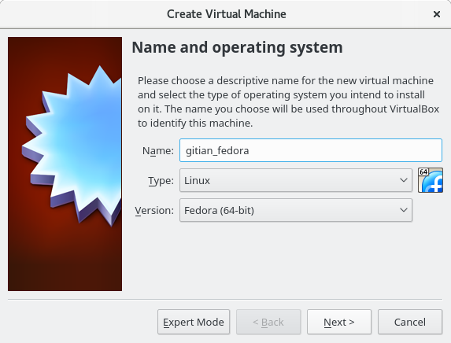

- Type: Linux, Fedora (64-bit)


- Memory Size: at least 3000MB, anything less and the build might not complete.


- Hard Disk: Create a virtual hard disk now

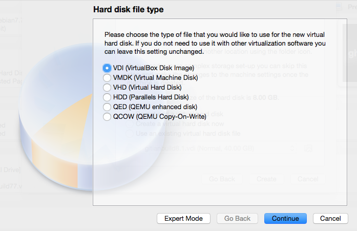

- Hard Disk file type: Use the default, VDI (VirtualBox Disk Image)

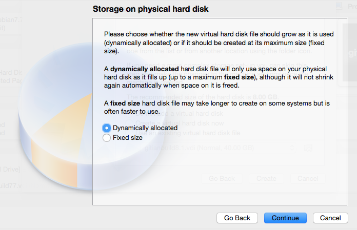

- Storage on physical hard disk: Dynamically Allocated

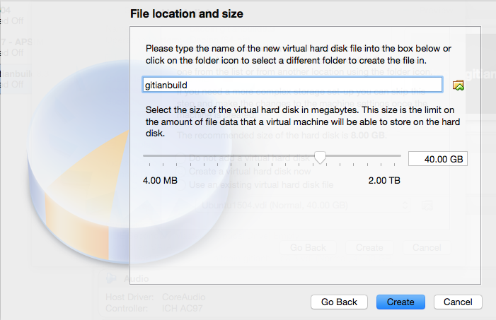

- File location and size: at least 40GB; as low as 20GB *may* be possible, but better to err on the safe side
- Click `Create`

After creating the VM, we need to configure it.

- Click the `Settings` button, then go to `System` tab and `Processor` sub-tab. Increase the number of processors to the number of cores on your machine if you want builds to be faster.

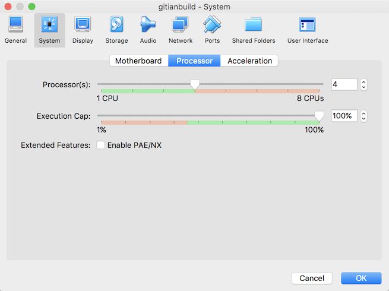

- Go to the `Network` tab. Adapter 1 should be attached to `NAT`.


- Click `Advanced`, then `Port Forwarding`. We want to set up a port through which we can reach the VM to get files in and out.
- Create a new rule by clicking the plus icon.

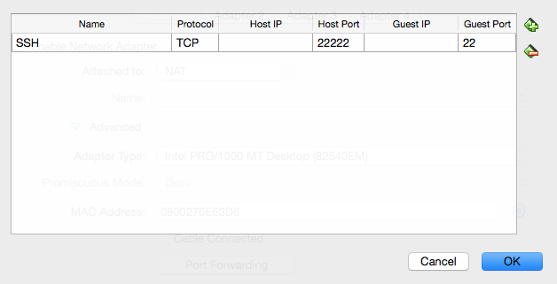

- Set up the new rule the following way:
  - Name: `SSH`
  - Protocol: `TCP`
  - Leave Host IP empty
  - Host Port: `22222`
  - Leave Guest IP empty
  - Guest Port: `22`

- Click `Ok` twice to save.

Get the [Fedora 26 Netinstall Image](https://download.fedoraproject.org/pub/fedora/linux/releases/26/Workstation/x86_64/iso/Fedora-Workstation-netinst-x86_64-26-1.5.iso) (any resonably recent release should work as well, see [Fedora Workstation Download page](https://getfedora.org/en/workstation/download/)).
This DVD image can be [validated](https://getfedora.org/verify) using a SHA256 hashing tool, for example on
Unixy OSes by entering the following in a terminal:

    echo "f514040516dc512119aad6316746569b231e157724d4f257af76825c483e1598  Fedora-Workstation-netinst-x86_64-26-1.5.iso" | sha256sum -c
    # (must return OK)

Then start the VM. On the first launch you will be asked for a CD or DVD image. Choose the downloaded ISO.

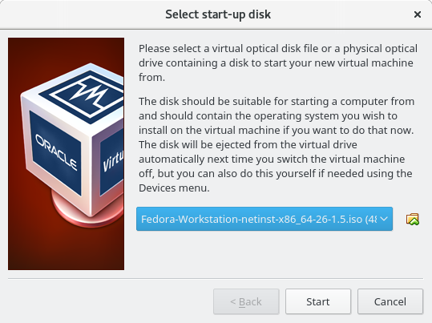

Installing Fedora
------------------

This section will explain how to install Fedora on the newly created VM.

- Choose the default option. This will start the graphical installer.

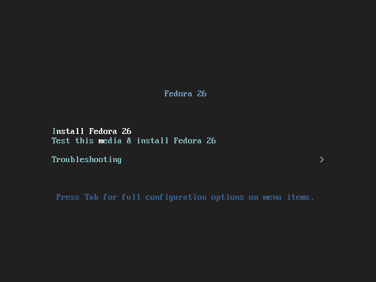

- Pick the language, locale and keyboard settings of your choice. You can just go with the defaults or select your own information.

- The VM will detect network settings using DHCP, this should all proceed automatically
- Afterward, the installer will automatically pick an appropriate *Installation Source* (closest mirror) and starts fetching the package metadata.
- Then, click the button for *Software Selection* and choose the *Minimal Install* from as the base environment and no addons for the selected environment. This will reduce installation time and disk usage.
- Finally, open the settings for *Installation Destination* and click *Done*. The default settings are just fine.

- The *Installation Summary* should look like this:

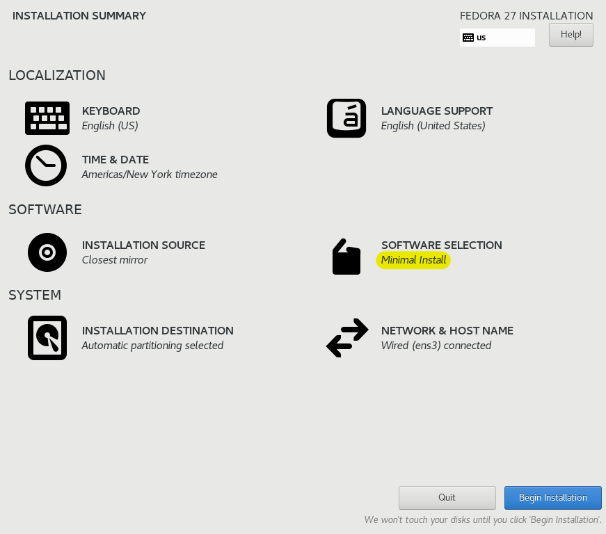

- Confirm by clicking on *Begin Installation*.
- Choose a root password and enter it twice (remember it for later)
- Also, create a new user. Name the new user `gitianuser` (the full name doesn't matter, you can leave it empty)
- Select *Make this user administrator* to add them to the wheel group.
- Choose a user password and enter it twice (remember it for later)

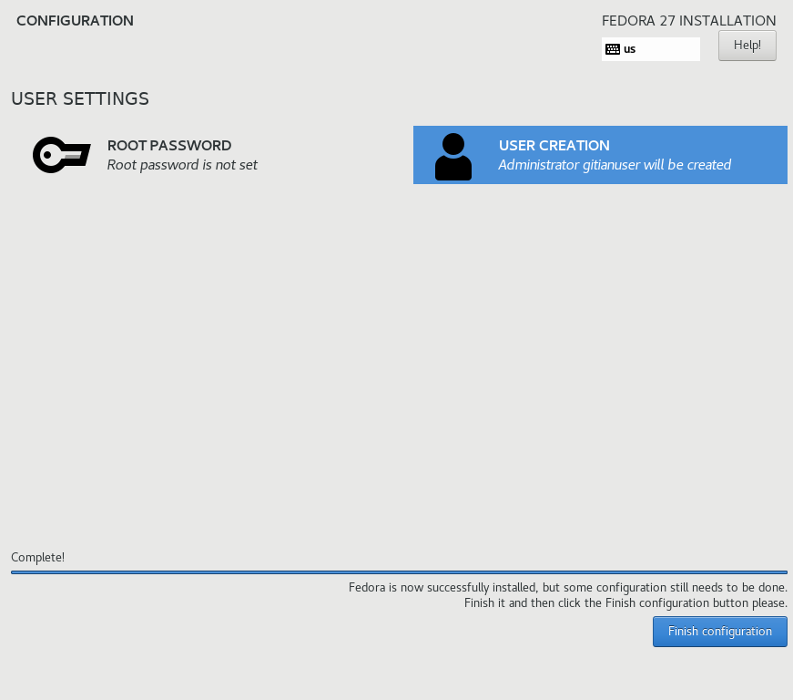

- Complete the installation by clicking *Finish configuration*. Then wait for it to complete and select *Reboot*.
- If the greeter asks you to install fedora, make sure to remove the ISO: In the running VirtualBox instance, select *Devices* > *Optical Drives* > *Remove disk from virtual drive*. Then reboot again.
- After reboot you will have a working Fedora VM. Congratulations!

You'll be presented with a screen similar to this.

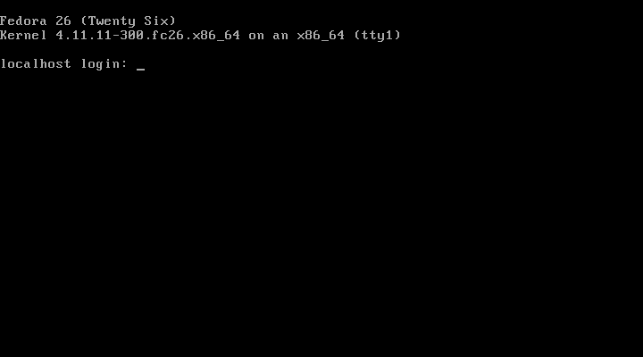

Connecting to the VM
----------------------
The next step in the guide involves logging in as root via SSH.

After the VM has booted you can connect to it using SSH, and files can be copied from and to the VM using a SFTP utility.
Connect to `localhost`, port `22222` (or the port configured when installing the VM).
On Windows you can use [putty](http://www.chiark.greenend.org.uk/~sgtatham/putty/download.html) and [WinSCP](http://winscp.net/eng/index.php).

For example, to connect as `root` from a Linux command prompt use

```
$ ssh root@localhost -p 22222
The authenticity of host '[localhost]:22222 ([127.0.0.1]:22222)' can't be established.
ECDSA key fingerprint is SHA256:Px5l4jnEItv44YnaESVlPMTu9gPYopIELKok99CjCvo.
Are you sure you want to continue connecting (yes/no)? yes
Warning: Permanently added '[localhost]:22222' (ECDSA) to the list of known hosts.
root@localhost's password: (enter root password configured during install)
[root@localhost ~]#
```

Replace `root` with `gitianuser` to log in as user.
